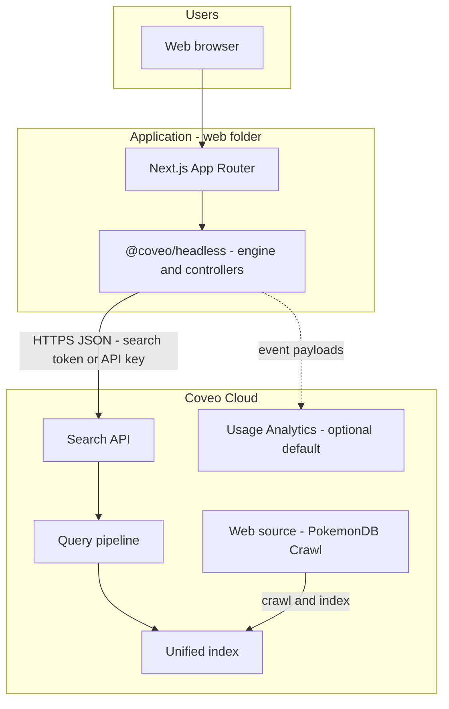

# Solution architecture

## 1. Scope

This solution delivers a **search experience** over Pokémon content crawled from **pokemondb.net** into a **Coveo Cloud** organization, with a **locally or publicly hosted** web application that issues queries and renders results, facets, and images.

## 2. Logical architecture

## 3. Runtime boundaries

| Layer | Responsibility | Technology |
|-------|----------------|------------|
| **Content acquisition** | Crawl allowed URLs, extract HTML and configured metadata, write **items** into the org index. | Coveo **Web** source (cloud crawler), **crawling rules**, **web scraping** (Admin Console). |
| **Search and relevance** | Parse queries, apply pipeline rules, retrieve and rank **results** and **facet** counts. | Coveo **Search API**, **index**, **query pipeline**. |
| **Search UI and state** | Search box, submit query, display results, facet selection, first-load search. | **Next.js** (React) + **Coveo Headless** (client-side). |
| **Authentication to Coveo** | Credentials presented with each search (and related) request. | **Anonymous Search API key** in dev (browser); **search tokens** recommended for production (issued by your backend—**not** implemented in current scaffold). |

## 4. Data flow (search request)

1. The user types a query and submits, or the app runs **`executeFirstSearch()`** on load.
2. **Headless** updates internal state and builds a **Search API** request (query text, facet selections, pagination defaults, `searchHub`, etc.).
3. **Search API** returns **hits**. Standard fields always surface on **`Result`**; **custom** indexed fields (e.g. `pokemontype`, `pokemongeneration`, `pictureuri`) appear in **`result.raw`** only when the **ResultList** controller sets **`fieldsToInclude`** for those names—see `web/src/coveo/search-instance.ts`.
4. **Controllers** (result list, facets, search box) notify subscribers; React re-renders.

## 5. Deployment view

| Artifact | Hosting |
|----------|---------|
| Coveo org | Coveo Cloud (trial/org provisioned for challenge). |
| Next.js app | Developer machine (`npm run dev`) today; may move to **Vercel**, **Azure**, etc., for the “hosted app” challenge requirement. |

Environment variables for the browser build use the **`NEXT_PUBLIC_`** prefix so the Headless engine can read **organization ID** and **access token** at runtime on the client. The UI only mounts the configured search surface when both org ID and API key are non-empty (**`coveoConfigured()`** in `web/src/coveo/search-instance.ts`).

## 6. Non-goals (current state)

- **No custom backend** for search-token minting or secret API keys.
- **No Coveo Atomic** UI components in this repo (Headless-only UI).
- **No SSR-first search**: search state is initialized on the client when **`coveoConfigured()`** is true at runtime (see [design-decisions.md](./design-decisions.md)).

## 7. Extension points

| Concern | Typical extension |
|---------|-------------------|
| Security | Server route that returns short-lived **search tokens**; remove public API key from the client. |
| Relevance | **Query pipeline** rules, **ranking**, **Coveo ML** (Query Suggest, etc.) in Admin. |
| Content | Additional **fields**, **web scraping** rules, or a **Push** source for alternative indexing. |
| UI | More Headless **controllers** (pagination, sort, query summary, etc.) or migration to **Atomic** for faster standard UI. |
