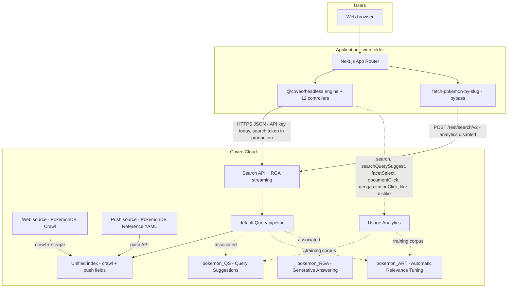

# Solution architecture

## 1. Scope

This solution delivers a **search experience** over Pokémon content from **pokemondb.net** (crawl) and **YAML push** enrichment in a **Coveo Cloud** organization, with a **locally or publicly hosted** web application that issues queries and renders results, facets, and images.

## 2. Logical architecture

## 3. Runtime boundaries

| Layer | Responsibility | Technology |
|-------|----------------|------------|
| **Content acquisition** | Crawl allowed URLs and/or **push** YAML documents; write **items** into the org index. | Coveo **Web** source (`PokemonDB Crawl`) + optional **Push** source (`PokemonDB Reference (YAML)` via Coveo Admin / your own Push pipeline), **crawling rules**, **web scraping** (Admin). |
| **Search and relevance** | Parse queries, apply pipeline rules, retrieve and rank **results** and **facet** counts. | Coveo **Search API**, **index**, **query pipeline**. |
| **Search UI and state** | Search box, submit query, display results, facet selection, first-load search. | **Next.js** (React) + **Coveo Headless** (client-side). |
| **Authentication to Coveo** | Credentials presented with each search (and related) request. | **Anonymous Search API key** in dev (browser); **search tokens** recommended for production (issued by your backend—**not** implemented in current scaffold). |

## 4. Data flow (search request)

1. The user types a query and submits, or the app runs **`executeFirstSearch()`** on load.
2. **Headless** updates internal state and builds a **Search API** request (query text, facet selections, pagination defaults, `searchHub`, etc.).
3. The request hits the **default Query Pipeline**, which applies any **Featured Result** rules and routes through associated **ML models** (`pokemon_QS` for type-ahead, `pokemon_ART` for click-based re-ranking, `pokemon_RGA` for the generative answer when applicable).
4. **Search API** returns **hits**. Standard fields always surface on **`Result`**; **custom** indexed fields (`pokemontype`, `pokemongeneration`, `pokemonability`, `pokemonbst`, `pokemonnationalnumber`, `pictureuri`, …) appear in **`result.raw`** only when the **ResultList** controller sets **`fieldsToInclude`** for those names — see `web/src/coveo/search-instance.ts`.
5. **Controllers** (search box, result list, **seven** string facets, **two** numeric facets — BST and catch rate — plus generated answer) notify subscribers; React re-renders via `useCoveoController`. (**Per-card** `buildInteractiveResult` is separate from `getSearchControllers()`.)
6. **On result-card click**, the per-card `buildInteractiveResult` controller calls `select()` to emit a `documentClick` analytics event before Next.js navigates to `/pokemon/[slug]`. That event becomes ART training data for the next learning cycle.
7. **The detail route** issues a separate `POST /rest/search/v2` via `fetch-pokemon-by-slug.ts` with `analytics: { enabled: false }` — deliberately outside the Headless engine so the detail fetch does not look like a user search. The slug query ORs **`pokemondb.net`** and **`www.pokemondb.net`** URI variants so the hit resolves regardless of indexed canonical host.
8. **Detail UI** renders a stacked **species** card + **Stats** card (same light catalog chrome as `/`); rationale and trade-offs in **`design-decisions.md` DD-16**.

## 5. Deployment view

| Artifact | Hosting |
|----------|---------|
| Coveo org (`roelc_Pokemon` trial) | Coveo Cloud. Holds the source, fields, default query pipeline, and three associated ML models. |
| Next.js app | **Local:** `cd web && npm run dev`. **Production:** **GitHub** is the source of truth; **Vercel** imports the repo, uses **Root Directory `web`**, **Framework Preset Next.js**, and the same **`NEXT_PUBLIC_*`** env vars as local; pushes to `main` (or a manual redeploy) run `next build` and serve the App Router app. Example: [https://pokemon-db-coveo-local.vercel.app/](https://pokemon-db-coveo-local.vercel.app/) (replace with your deployment URL when documenting for stakeholders). |
| Optional ML / Push automation | **Not in repository** (`tools/` gitignored). Use manual app usage or private scripts for ML warm-up / Push ingestion. |

**Pipeline (summary):** code changes are **committed and pushed to GitHub** → Vercel **builds** the `web/` package → the **live site** serves static + serverless output for Next.js. Operational checklist (root directory, framework preset, Node version, redeploy after settings changes) is documented in the root `README.md` section *Deployment (GitHub → Vercel)*. **Security:** HTTP headers in `next.config.ts`, **CSP + nonce proxy** (`web/src/proxy.ts`), and **`next/image` allowlists** — see [security-review.md](./security-review.md) and **DD-14** in [design-decisions.md](./design-decisions.md).

Environment variables for the browser build use the **`NEXT_PUBLIC_`** prefix so the Headless engine can read **organization ID** and **access token** at runtime on the client. The UI only mounts the configured search surface when both org ID and API key are non-empty (**`coveoConfigured()`** in `web/src/coveo/search-instance.ts`).

## 6. Non-goals (current state)

- **No custom backend** for search-token minting or secret API keys (see `design-decisions.md` DD-3).
- **No Coveo Atomic** UI components in this repo (Headless-only UI; see DD-1).
- **No SSR-first search**: search state is initialized on the client when **`coveoConfigured()`** is true at runtime (DD-5).
- **No Indexing Pipeline Extension (IPE)** for BST bucketing — the five community tier ranges live in app code (`BST_TIERS`) instead, so adjusting boundaries doesn't require a re-index (DD-10).

## 7. Extension points

| Concern | Typical extension | Status |
|---------|-------------------|--------|
| Security | Server route that returns short-lived **search tokens**; remove public API key from the client. | Open — see DD-3 |
| Relevance — featured results | Result-ranking pin rules in default pipeline. | **Shipped** — Pikachu + starter pins |
| Relevance — ML | Three models (QS, RGA, ART) associated to default pipeline. | **Shipped** — see `coveo-platform-and-headless.md` §1 |
| Content | Additional **fields**, **web scraping** rules, or **push** enrichment. | Crawl supplies core species fields; YAML push adds release, growth rate, catch rate, form, EV yield, etc. Per-stat HP–Speed integers are in the index for sort/ranking; home UI uses **BST** + **catch rate** numeric facets. |
| UI — pagination | `buildPager` controller. | Not implemented (small dex ~1300 species fits one search) |
| UI — sort | `buildSort` controller. Sortable fields available: all 7 integer stat fields. | Not implemented |
| UI — related Pokémon strip on detail page | Second Coveo query filtered by type/generation. | Deferred (see `next-steps.md`) |
| Bonus — Passage Retrieval API | Optional extension: build against the Passage Retrieval API or document a POV. | Not implemented (see `next-steps.md` §3.9). |
